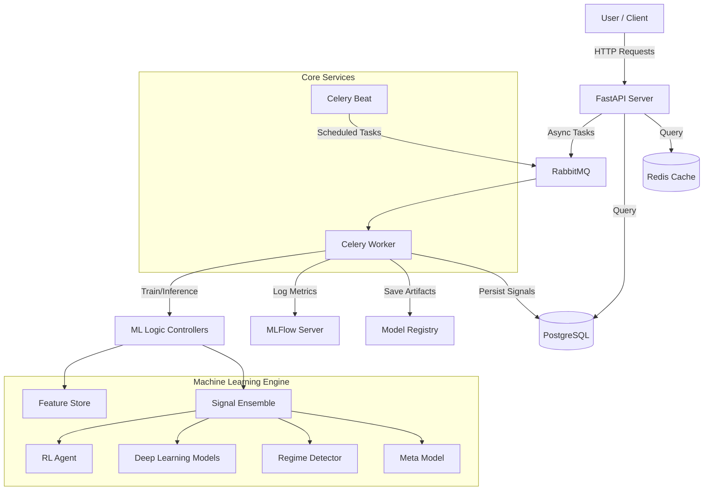

# QuantumTrader 🚀

**QuantumTrader** is an advanced, quantitative trading system powered by an ensemble of machine learning models (Deep Learning, Reinforcement Learning, and XGBoost). It is designed to autonomously generate high-confidence trading signals by analyzing market data, detecting regimes, and dynamically adjusting risk management parameters.

## 📋 Project Overview

QuantumTrader is not just a model; it's a full-stack MLOps platform for algorithmic trading. It bridges the gap between research and production by providing:

*   **Ensemble Intelligence:** Combines PyTorch-based Deep Learning models, StableBaselines3 Reinforcement Learning agents, and XGBoost classifiers.
*   **Market Regime Detection:** Dynamically adapts trading strategies (stop-loss, leverage, range) based on detected market volatility (Low, Normal, High).
*   **Asynchronous Architecture:** Built on FastAPI and Celery to handle heavy ML training and inference tasks without blocking the API.
*   **MLOps Integration:** Full integration with MLFlow for experiment tracking, model registry, and artifact management.
*   **Robust Signal Generation:** Uses a Triple Barrier Method for labeling and a meta-model to score the confidence of every generated signal.

## 🏗️ Architecture

The system follows a microservices-like architecture containerized via Docker.



### Key Components

*   **API (`/api`):** The entry point for the system. Manages assets and triggers async tasks.
*   **Celery Workers:** Execute heavy-lifting tasks (training pipelines, signal generation) in the background.
*   **Feature Store:** Centralized data access layer for retrieving consistent training and online inference features.
*   **Signal Ensemble:** The brain of the system. It aggregates votes from:
    *   **Deep Learning Models:** PyTorch-based sequence models (CNN, LSTM).
    *   **RL Agent:** A PPO/A2C agent trained to maximize reward.
    *   **Regime Detector:** Classifies market conditions to adjust risk.
    *   **Meta Model:** Predicts the probability of the ensemble being correct (Confidence Score).
*   **MLFlow:** Tracks experiments, parameters, and metrics. Serving as the model registry.

## 🚀 Features

*   **🔥 Automated Signal Generation:** Generates actionable signals with Entry, Stop Loss, and Take Profit levels.
*   **🧠 Triple Barrier Labeling:** Uses advanced financial labeling to create realistic training targets.
*   **🛡️ Dynamic Risk Management:** Adjusts leverage and position sizing based on Model Confidence and Market Volatility.
*   **🔄 End-to-End Training Pipeline:** Automated fetching, preprocessing, training, evaluation, and artifact registration.
*   **🐳 Fully Containerized:** One-command deployment using Docker Compose.

## 🛠️ Tech Stack

*   **Language:** Python 3.10+
*   **Framework:** FastAPI
*   **Task Queue:** Celery + RabbitMQ + Redis
*   **Database:** PostgreSQL (SQLAlchemy + AsyncPG)
*   **ML Libraries:** PyTorch, XGBoost, StableBaselines3, Scikit-Learn, Pandas, Numpy
*   **MLOps:** MLFlow
*   **Infrastructure:** Docker, Docker Compose

## ⚡ Setup & Installation

### Prerequisites
*   Docker & Docker Compose installed on your machine.
*   (Optional) Python 3.10+ for local development.

### Quick Start (Docker)

1.  **Clone the repository:**
    ```bash
    git clone https://github.com/k-ranasinghe/quantum-trader
    cd quantum-trader
    ```

2.  **Start the services:**
    ```bash
    docker-compose up --build -d
    ```

    This will spin up:
    *   **API:** http://localhost:8000
    *   **MLFlow:** http://localhost:5000
    *   **RabbitMQ Console:** http://localhost:15672 (guest/guest)
    *   **PostgreSQL** & **Redis**

3.  **Verify installation:**
    Visit `http://localhost:8000/docs` to see the Swagger UI.

### Local Development Setup

1.  **Create a virtual environment:**
    ```bash
    python -m venv .venv
    
    # On Linux/macOS
    source .venv/bin/activate
    
    # On Windows
    source .venv\Scripts\activate
    ```

2.  **Install dependencies:**
    ```bash
    pip install -r requirements.txt
    ```

3.  **Configure Environment:**
    Copy `.env.example` to `.env` (create one if missing) and set your database URLs.

4.  **Run the API:**
    ```bash
    uvicorn main:app --reload
    ```

5.  **Run Celery Worker:**
    ```bash
    celery -A config.celery_app worker --loglevel=info
    ```

## 📖 Usage

### 1. Create an Asset
Register a new asset to track.
```bash
POST /assets
{
  "symbol": "BTC-USD",
  "timeframe": "5m"
}
```

### 2. Train Models
Trigger the training pipeline for the asset. This runs asynchronously.
```bash
POST /train
{
  "asset_symbol": "BTC-USD",
  "timeframe": "5m"
}
```
*Check Celery logs or MLFlow to monitor progress.*

### 3. Generate Signals (Inference)
Ask the system to analyze the market and generate a signal.
```bash
POST /inference?asset_symbol=BTC-USD
```

### 4. Retrieve Signals
Get the latest generated signals.
```bash
GET /signals?asset_symbol=BTC-USD
```
**Response:**
```json
[
  {
    "action": "Long",
    "entry_min": 89372.13,
    "entry_max": 88825.28,
    "stop_loss": 88529.02,
    "take_profit_1": 90968.78,
    "take_profit_2": 90518.94,
    "take_profit_3": 90394.99,
    "leverage": 12,
    "confidence": 0.88,
    "regime": "Low Volatility",
    "timestamp": "2025-12-08T12:48:36.364601Z"
  }
]
```

## 📂 Project Structure

```
quantum-trader/
├── api/                # FastAPI routes and endpoints
├── config/             # Configuration (Settings, Constants, Celery)
├── controllers/        # Core Logic (Ensemble, Model controllers)
├── database/           # DB Models and Connection logic
├── environments/       # RL Environments (Gymnasium)
├── generators/         # Model wrappers (PyTorch, RL)
├── labellers/          # Data Labeling logic (Triple Barrier)
├── models/             # Deep Learning Model Definitions
├── services/           # Business Logic Services (Train, Inference)
├── utilities/          # Helper functions and Async Tasks
├── main.py             # Application Entry Point
├── docker-compose.yml  # Container orchestration
└── requirements.txt    # Dependencies
```

## ⚠️ Disclaimer
This software is for educational and research purposes only. Do not use it for real money trading without extensive testing and validation. The author is not responsible for any financial losses.
